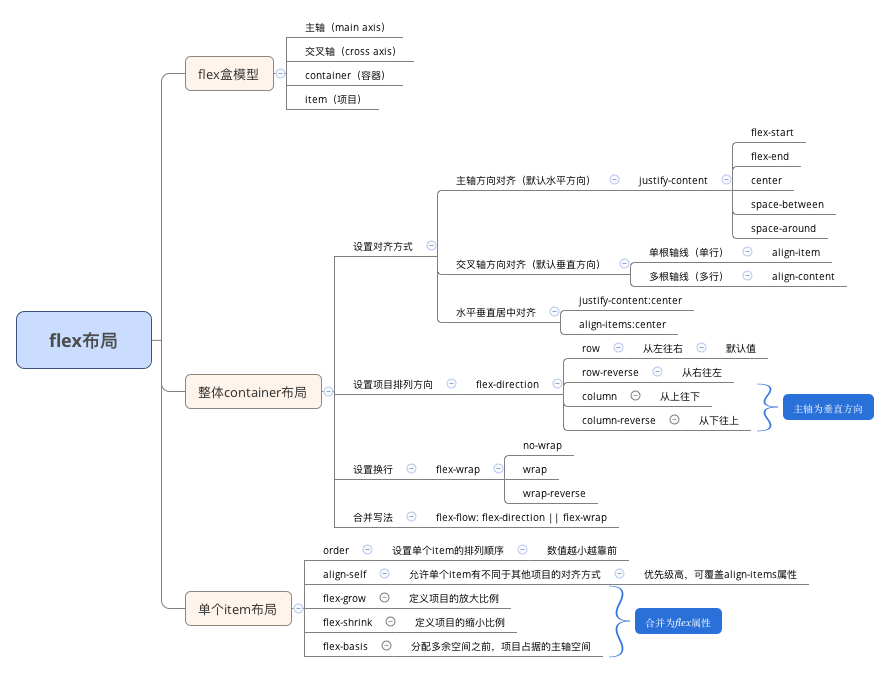
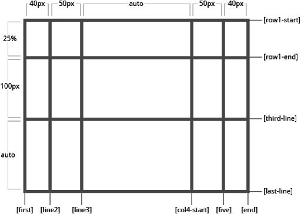
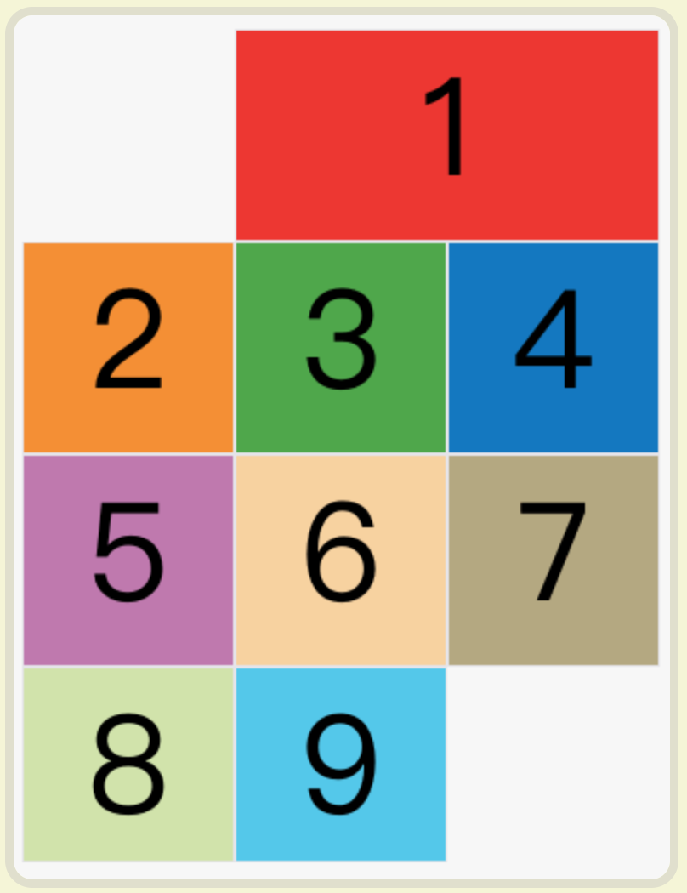

# CSS布局

## 布局分类

* 固定宽度布局，一般宽度为960px / 1000px / 1024px。
* 不固定宽度布局，主要靠文档流的原理来布局。（文档流本来就是自适应的，不需要加额外的样式）
* 响应式布局，pc上固定布局，手机上不固定布局，是一种混合式布局。

## 布局的两种思路

### 1. 从大到小

* 先定下大局
* 然后每个部分的小布局

### 2. 从小到大

* 先从小的入手，完成局部的布局
* 然后再组合成大布局

两种布局思路均可，新人更适合第二种，从小的入手会简单一些。老手一般用第一种，因为有成型的大局观。

## 布局方案

### 1. float布局

### 实现原理

* 子元素上加float（left/right）属性和width属性
* 父元素上加 .clearfix类（清除浮动）

经验：有经验者会留一些空间或者最后一个不设width不需要做响应式，因为手机上没有IE，这个布局是专门为IE准备的。

### 不同布局

* 用float 做两栏布局（如顶部条）
* 用float 做三栏布局（如内容区）
* 用float 做四栏布局（如导航）
* 用float 做平均布局（如产品展示区）

经验：

1. 加上头尾，即可满足所有PC页面需求。
2. 手机页面傻子采用float。
3. float要自己计算宽度，不灵活。
4. float足以用来应付IE。

### flex布局（一维布局）

* 脑图:




#### flex盒模型概念

* 主轴（main axis）
* 交叉轴（cross axis）
* 容器（container）
* item（项目/子元素）

用于放置内容的容器container, 水平方向的主轴main axis, 垂直方向的交叉轴cross axis, 还有需要布局的项目item。
flex布局意为弹性布局，为盒模型提供最大的灵活性。任何一个容器都可以指定为flex布局。

设置flex布局： 

```
  .container {
     display: flex | inline-flex;
  }
```

#### 容器container的属性

Flex布局的属性分成两类。一类定义在容器上面，称为容器属性；另一类定义在项目上面，称为项目属性。这部分先介绍容器属性。

###### 1. flex-direction: 主轴方向（items的流动方向）

```
  flex-direction: row | row-reverse | column |column-reverse;
```

* row：主轴在水平方向，从左往右排列；默认值；
* row-reverse：主轴在水平方向，从右往左排列；
* column：主轴在垂直方向，从上往下；
* column-reverse：主轴在垂直方向，从下往上；

###### 2. flex-wrap: 设置换行方式

```
  flex-wrap: nowrap | wrap | wrap-reverse;
````

* nowrap：不换行；
* wrap：换行，第一行在上方，剩下的往下排；
* wrap-reverse：换行，第一行在下方，剩下的往上排；

###### 3. justify-content: 主轴对齐方式

```
  justify-content: flex-start | flex-end | center | space-between | space-around | space-evenly;
```

* flex-start：从左往右
* flex-end：从右往左
* center：水平居中
* space-between：每个item之间是等宽的
* space-around： 每个item左右侧的宽度都是相等的
* space-evenly： ......

###### 4. align-items：次轴对齐

```
  align-items: flex-start | flex-end | center |stretch | baseline;
```

* flex-start: 顶部对齐
* flex-end: 底部对齐
* center: 垂直居中
* baseline: 基线对齐
* stretch: 将item拉到一般高对齐

###### 5. align-content: 多行内容分布

```
  align-content: flex-start | flex-end | center | stretch | space-between |space-around;
```

#### 子元素item的属性

1. order: 元素的排序，按从小到大排列，默认值为0，可取负值。

2. flex-grow: 空间膨胀系数，指定空间变宽时如何分配，按每个元素的flex-grow的值的比例进行分配，默认值为0。

3. flex-shrink: 空间压缩系数，指定空间变窄时如何分配，只有当空间小于原始宽度总和时，按压缩系数比进行压缩，默认值为1，值为0表示不接受压缩。

4. flex-basis: 元素的基准宽度。

5. align-self: 定制某个元素自己的次轴对齐方式，和align-items的可取值是相同的。

### grid布局（二维布局）

#### grid布局概述

网格布局（Grid）是最强大的 CSS 布局方案。

它将网页划分成一个个网格，可以任意组合不同的网格，做出各种各样的布局。以前，只能通过复杂的 CSS 框架达到的效果，现在浏览器内置了。

Grid 布局与 Flex 布局有一定的相似性，都可以指定容器内部多个项目的位置。但是，它们也存在重大区别。

Flex 布局是轴线布局，只能指定"项目"针对轴线的位置，可以看作是一维布局。Grid 布局则是将容器划分成"行"和"列"，产生单元格，然后指定"项目所在"的单元格，可以看作是二维布局。Grid 布局远比 Flex 布局强大。

#### grid盒模型概念

* container（容器）
* item （项目/子元素）
* row（行）和column（列）
* cell（单元格）
* grid line（网格线）



采用网格布局的区域，称为"容器"（container）。容器内部采用网格定位的子元素，称为"项目"（item）。

设置grid布局：

```
  display：grid | inline-grid；
```

注意，设为网格布局以后，容器子元素（项目）的float、display: inline-block、display: table-cell、vertical-align和column-*等设置都将失效。

#### 容器container的属性

Grid 布局的属性分成两类。一类定义在容器上面，称为容器属性；另一类定义在项目上面，称为项目属性。这部分先介绍容器属性。
容器属性包含：grid-template-columns | grid-template-rows / grid-row-gap | grid-column-gap / grid-template-areas / grid-auto-flow / 
justify-items | align-items / justify-content | align-content / grid-auto-columns | grid-auto-rows。

###### 1. grid-template-columns和grid-template-rows 属性

grid-template-columns属性定义每一列的列宽，grid-template-rows定义每一行的行高，可以使用绝对单位，也可以使用百分比。

```
  .container {
    grid-template-columns: 100px 100px 100px;
    grid-template-rows: 100px 100px 100px;
  }
```

* repeat()函数

有时候，重复写同样的值非常麻烦，尤其网格很多时。这时，可以使用repeat()函数，简化重复的值。

```
  .container {
    grid-template-columns: repeat(3, 100px);
  }
```

也可以对某种模式进行重复

```
  .container {
    grid-template-columns: repeat(3, 100px 80px 60px);
  }
```

* auto-fill关键字

有时，单元格的大小是固定的，但是容器的大小不确定。如果希望每一行（或每一列）容纳尽可能多的单元格，这时可以使用auto-fill关键字表示自动填充。

```
  .container {
    grid-template-columns: repeat(auto-fill, 100px);
  }
```

* fr关键字

为了方便表示比例关系，网格布局提供了fr关键字（fraction 的缩写，意为"片段"），表示份数或是比例。同时可以使用像素单位或是百分数进行混合式分配。

```
  .container {
    grid-template-columns: 1fr 1fr 1fr 100px;
  }
```

* minmax()函数

minmax()函数产生一个长度范围，表示长度就在这个范围之中。它接受两个参数，分别为最小值和最大值。

```
  .container {
    grid-template-columns: 1fr 1fr minmax(100px, 1fr);
  }
```

* auto关键字 

auto关键字表示由浏览器自己决定长度。

```
  .container {
    grid-template-columns: 100px auto 100px;
  }
```

* 网格线的名称

grid-template-columns属性和grid-template-rows属性里面，还可以使用方括号，指定每一根网格线的名字，方便以后的引用。网格布局允许同一根线有多个名字，比如[fifth-line row-5]。

```
  .container {
    display: grid;
    grid-template-columns: [c1] 100px [c2] 100px [c3] auto [c4];
    grid-template-rows: [r1] 100px [r2] 100px [r3] auto [r4];
}
```

###### 2. grid-row-gap和gird-column-gap 属性 (简写属性：grid-gap)

grid-row-gap属性设置行与行的间隔（行间距），grid-column-gap属性设置列与列的间隔（列间距）。

```
  .container {
    grid-row-gap: 20px;
    grid-column-gap: 20px;
  }
```

grid-gap属性是grid-column-gap和grid-row-gap的合并简写形式，如果grid-gap省略了第二个值，浏览器认为第二个值等于第一个值。

```
  grid-gap: <grid-row-gap> <grid-column-gap>;
```

（根据最新标准，上面三个属性名的grid-前缀已经删除，grid-column-gap和grid-row-gap写成column-gap和row-gap，grid-gap写成gap。）

###### 3. grid-template-areas 属性

网格布局允许指定"区域"（area），一个区域由单个或多个单元格组成。grid-template-areas属性用于定义区域。如果某些区域不需要利用，则使用"点"（.）表示。

```
  .container {
    display: grid;
    grid-template-columns: 100px 100px 100px;
    grid-template-rows: 100px 100px 100px;
    grid-template-areas: 'a b c'
                         'd e f'
                         'g h i';
  }
```

上面代码先划分出9个单元格，然后将其定名为a到i的九个区域，分别对应这九个单元格。

多个单元格合并成一个区域的写法如下。

```
  grid-template-areas: 'a a a'
                       'b b b'
                       'c c c';
```

上面代码将9个单元格分成a、b、c三个区域。

注意，区域的命名会影响到网格线。每个区域的起始网格线，会自动命名为区域名-start，终止网格线自动命名为区域名-end。

比如，区域名为header，则起始位置的水平网格线和垂直网格线叫做header-start，终止位置的水平网格线和垂直网格线叫做header-end。


###### 4. grid-auto-flow 属性

划分网格以后，容器的子元素会按照顺序，自动放置在每一个网格。默认的放置顺序是"先行后列"，即先填满第一行，再开始放入第二行。

这个顺序由grid-auto-flow属性决定，默认值是row，即"先行后列"。也可以将它设成column，变成"先列后行"。

```
  grid-auto-flow: column;
```

grid-auto-flow属性除了设置成row和column，还可以设成row dense和column dense。这两个值主要用于，某些项目指定位置以后，剩下的项目怎么自动放置。
属性值设为row dense，表示"先行后列"，并且尽可能紧密填满，尽量不出现空格。属性值设为column dense，表示"先列后行"，并且尽可能紧密填满，尽量不出现空格。

###### 5. justify-items和aligns-items 属性（简写属性：space-items）

justify-items属性设置单元格内容的水平位置（左中右），align-items属性设置单元格内容的垂直位置（上中下）。

```
  .container {
    justify-items: start | end | center | stretch;
    align-items: start | end | center | stretch;
  }
```

* start：对齐单元格的起始边缘。
* end：对齐单元格的结束边缘。
* center：单元格内部居中。
* stretch：拉伸，占满单元格的整个宽度（默认值）。

place-items属性是align-items属性和justify-items属性的合并简写形式。如果省略第二个值，则浏览器认为与第一个值相等。

```
  place-items: <align-items> <justify-items>;
```

###### 6. justify-content和align-content（简写属性：place-content）

justify-content属性是整个内容区域在容器里面的水平位置（左中右），align-content属性是整个内容区域的垂直位置（上中下）。

```
  .container {
    justify-content: start | end | center | stretch | space-around | space-between | space-evenly;
    align-content: start | end | center | stretch | space-around | space-between | space-evenly;  
  }
```

* start -- 对齐容器的起始边框。
* end -- 对齐容器的结束边框。
* center -- 容器内部居中。
* stretch -- 项目大小没有指定时，拉伸占据整个网格容器。
* space-around -- 每个项目两侧的间隔相等。所以，项目之间的间隔比项目与容器边框的间隔大一倍。
* space-between - 项目与项目的间隔相等，项目与容器边框之间没有间隔。
* space-evenly - 项目与项目的间隔相等，项目与容器边框之间也是同样长度的间隔。

place-content属性是align-content属性和justify-content属性的合并简写形式，如果省略第二个值，浏览器就会假定第二个值等于第一个值。

```
  place-content: <align-content> <justify-content>
```

###### 7. grid-auto-columns和grid-auto-rows 属性

有时候，一些项目的指定位置，在现有网格的外部。比如网格只有3列，但是某一个项目指定在第5行。这时，浏览器会自动生成多余的网格，以便放置项目。

grid-auto-columns属性和grid-auto-rows属性用来设置，浏览器自动创建的多余网格的列宽和行高。它们的写法与grid-template-columns和
grid-template-rows完全相同。如果不指定这两个属性，浏览器完全根据单元格内容的大小，决定新增网格的列宽和行高。

```
  .container {
    display: grid;
    grid-template-columns: 100px 100px 100px;
    grid-template-rows: 100px 100px 100px;
    grid-auto-rows: 50px; 
  }
```
上面代码指定新增的行高统一为50px（原始的行高为100px）。

###### 8. grid-template 属性，grid 属性

grid-template属性是grid-template-columns、grid-template-rows和grid-template-areas这三个属性的合并简写形式。

grid属性是grid-template-rows、grid-template-columns、grid-template-areas、 grid-auto-rows、grid-auto-columns、grid-auto-flow这六个属性的合并简写形式。

从易读易写的角度考虑，还是建议不要合并属性，所以这里就不详细介绍这两个属性了。

#### 项目属性

项目属性包含：grid-column-start | grid-row-start / grid-row-start | grid-row-start / grid-area / justify-self | align-self 。

###### 1. grid-column-start和grid-column-end 属性；grid-row-start和grid-row-end 属性

项目的位置是可以指定的，具体方法就是指定项目的四个边框，分别定位在哪根网格线。

* grid-column-start属性：左边框所在的垂直网格线
* grid-column-end属性：右边框所在的垂直网格线 
* grid-row-start属性：上边框所在的水平网格线
* grid-row-end属性：下边框所在的水平网格线

```
  .item-1 {
    grid-column-start: 2;
    grid-column-end: 4;
  }
```



上图中，只指定了1号项目的左右边框，没有指定上下边框，所以会采用默认位置，即上边框是第一根水平网格线，下边框是第二根水平网格线。除了1号项目以外，
其他项目都没有指定位置，由浏览器自动布局，这时它们的位置由容器的grid-auto-flow属性决定，这个属性的默认值是row，因此会"先行后列"进行排列。
读者可以把这个属性的值分别改成column、row dense和column dense，看看其他项目的位置发生了怎样的变化。

这四个属性的值还可以使用span关键字，表示"跨越"，即左右边框（上下边框）之间跨越多少个网格。

```
  .item-1 {
    grid-column-start: span 2;
  }
```

上面代码表示，1号项目的左边框距离右边框跨越2个网格。使用这四个属性，如果产生了项目的重叠，则使用z-index属性指定项目的重叠顺序。

grid-column属性是grid-column-start和grid-column-end的合并简写形式，grid-row属性是grid-row-start属性和grid-row-end的合并简写形式。
这两个属性之中，也可以使用span关键字，表示跨越多少个网格。

```
  .item-1 {
    grid-column: 1 / 3;
    grid-row: 1 / 2;
  }
```

###### 2. grid-area 属性

```
  .item-1 {
    grid-area: e;
  }
```

grid-area属性还可用作grid-row-start、grid-column-start、grid-row-end、grid-column-end的合并简写形式，直接指定项目的位置。

```
  .item {
    grid-area: <row-start> / <column-start> / <row-end> / <column-end>;
  }
```

###### 3. justify-self和align-self 属性

justify-self属性设置单元格内容的水平位置（左中右），跟justify-items属性的用法完全一致，但只作用于单个项目。
align-self属性设置单元格内容的垂直位置（上中下），跟align-items属性的用法完全一致，也是只作用于单个项目。

```
  .item {
    justify-self: start | end | center | stretch;
    align-self: start | end | center | stretch;
  }
```

* start：对齐单元格的起始边缘。
* end：对齐单元格的结束边缘。
* center：单元格内部居中。
* stretch：拉伸，占满单元格的整个宽度（默认值）。

place-self属性是align-self属性和justify-self属性的合并简写形式。如果省略第二个值，place-self属性会认为这两个值相等。

```
  place-self: <align-self> <justify-self>;
```


##  参考链接： https://www.ruanyifeng.com/blog/2019/03/grid-layout-tutorial.html


