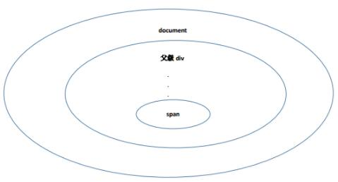

# DOM 事件模型

早期由于浏览器厂商对于浏览器市场的争夺，各家浏览器厂商对同一功能的JavaScript的实现都不进相同，本节内容介绍JavaScript的DOM事件模型及事件处理程序的分类。

## DOM事件流三个阶段

* 冒泡阶段 -- 由最具体的元素接收（也就是事件发生所在的节点），然后逐级传播到较为不具体的节点
* 处于目标阶段 -- 当某个事件发生时,事件触发到了具体元素时，在具体元素上发生的阶段，但是概念划分是被看成冒泡阶段的一部分
* 捕获阶段 -- 与事件冒泡正好相反，当某个事件发生时，父元素应该更早接收到事件，具体元素则最后接收到事件

## DOM事件模型

DOM事件模型分为两种：事件冒泡和事件捕获。事件冒泡最初是微软提出的DOM事件流的模型，顾名思义，就是值浏览器的事件流如同冒泡一样，
从最低处到最高处。最低处对应的是DOM中最具体的元素，最高处则是最外层元素，最外层元素一般就是document元素。



### 1. 事件冒泡模型：

当点击最底层的span元素时，在冒泡模型中触发的事件流为：span的click事件触发---->父级元素div的click事件触发---->顶层的document元素的click事件触发

### 2. 事件捕获模型：

当点击span元素时，在事件捕获模型中触发的事件流为：最顶层的document的click事件首先被触发---->子容器div（同时也是span的父容器）的click事件被触发

事件冒泡和事件捕获的事件触发流程是完全相反的


## DOM事件处理程序的分类

DOM事件处理程序分为三种：html事件处理程序、DOM 0级事件处理程序、DOM 2级事件处理程序（注意：没有DOM1级事件处理程序）。

### 1. html事件处理程序：

指的是事件绑定直接写在html上：

```
  <input type="button' value="button" onclick="alert('button clicked!')" />
```

这里button的click事件的绑定直接写在html中，这种写法即是html事件处理程序。由于这种写法造成html和JavaScript的紧耦合，当需要调整JavaScript事件时，
不得不调整html代码（就算不修改JavaScript函数名，只修改函数的内部实现，仍然不推荐使用这种语法绑定事件，会增加不必要的维护成本）。

### 2. DOM 0级事件处理程序：

指的是通过给JavaScript对象的事件参数属性赋值的模式：

```
  <input id="btn" type="button" value="button" />
  <script>
      var btn = document.getElementById("btn")
      btn.onclick = () => {
          alert("something clicked!")
      }
  </script>
```
如需注销，只需将该属性设置为null即可：

```
  <script>
      btn.onclick = null
  </script>
```

### 3. DOM 2级事件处理程序：

指的是使用 addEventListener("eventName","eventHandle",false)，其中eventName表示事件名称、eventHandle表示事件处理函数，
false表示是否启用事件捕获模式，默认为false。使用addEventListener函数来给DOM元素绑定事件处理程序:

```
  <input id="btn" type="button" value="button" />
  <script>
      var btn = document.getElementById("btn")
      btn.addEventListener("click",handle,false)
      function handle(){
          alert("something clicked!")
      }
  </script>
```

注意：通过addEventListener绑定的事件只能通过removeEventListener来注销，不能使用DOM 0级中的方式注销事件处理程序:

```
  <script>
      btn.removeEventListener("click",handle)
  </script>
```

如果想要移除事件处理程序，最好在绑定事件处理程序时使用具名函数。

IE中DOM 2级事件处理程序的是通过attachevent来绑定的，语法与addEventListener完全一致

### 4. DOM 0级和DOM 2级事件处理程序的主要区别

DOM 0级事件处理程序只能给元素的事件绑定一个处理程序，如果给同一类型的事件绑定了多个事件处理程序，后面的事件处理程序会覆盖掉前面的：

```
  <input id="btn" type="button" value="button" />
  <script>
      var btn = document.getElementById("btn")
      btn.onclick = handle1()
      btn.onclick = handle2()
      function handle1(){
          alert("something clicked!")
      }
      function handle2(){
          alert("something clicked again!")
      }
  </script>
```

点击事件只会绑定事件处理程序handle2，而是handle1会被handle2覆盖掉。

DOM 2级事件处理程序可以给元素的事件绑定多个处理程序：

```
  <input id="btn" type="button" value="button" />
  <script>
      var btn = document.getElementById("btn")
      btn.addEventListener("click",handle1,false)
      btn.addEventListener("click",handle2,false)
      function handle1(){
          alert("something clicked!")
      }
      function handle2(){
          alert("something clicked again!")
      }
  </script>
```

开发过程中推荐使用DOM 0级事件处理程序或者DOM 2级事件处理程序，如果只有一个事件处理程序DOM 0级就足够了，当然，如需绑定多个事件处理程序，则需使用DOM 2级事件处理程序。


