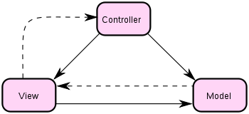

# 浅析 MVC

## MVC 的三个对象

MVC包括三类对象，将他们分离以提高灵活性和复用性。

* 模型model用于封装与应用程序的业务逻辑相关的数据以及对数据的处理方法，会有一个或多个视图监听此模型。一旦模型的数据发生变化，模型将通知有关的视图。
* 视图view是它在屏幕上的表示，描绘的是model的当前状态。当模型的数据发生变化，视图相应地得到刷新自己的机会。
* 控制器controller定义用户界面对用户输入的响应方式，起到不同层面间的组织作用，用于控制应用程序的流程，它处理用户的行为和数据model上的改变。

经典MVC模式

其中涉及两种设计模式

* view和model之间的观察者模式，view观察model，事先在此model上注册，以便view可以了解在数据model上发生的改变。

* view和controller之间的策略模式

一个策略是一个表述算法的对象，MVC允许在不改变视图外观的情况下改变视图对用户输入的响应方式。例如，你可能希望改变视图对键盘的响应方式，
或希望使用弹出菜单而不是原来的命令键方式。MVC将响应机制封装在controller对象中。存在着一个controller的类层次结构，使得可以方便地
对原有的controller做适当改变而创建新的controller。

view使用controller子类的实例来实现一个特定的响应策略。要实现不同的响应的策略只要用不同种类的controller实例替换即可。甚至可以在运
行时刻通过改变view的controller来改变用户输入的响应方式。例如，一个view可以被禁止接受任何输入，只需给他一个忽略输入事件的controller。

## EventBus 的API

### EventBus.on

用于监听View视图层用户输入事件，对Modle层的数据进行操作

### EventBus.trigger

用于触发事件，监控Modle层的数据，数据发生变化时，触发事件，将数据的变化反应到View视图层

### EventBus.off

用于取消事件

## 表驱动编程

表驱动是什么：

* 通过查找数据表来代替复杂的逻辑结构（如 if ... else ......, switch等）
* 你需要找什么，指定索引，就可以给你立即返回索引在表中对应的元素 或者动作；

表驱动的优点是：

1. 将编程的重心调整到解决问题上，而不是复杂的逻辑判断；
2. 增加了程序的灵活性，易添加，易修改；
3. 数据驱动，如果将数据写入文件，每次启动时，从文件中读取，那么，如果要修改一些变量，可能直接修改数据文件，而不是去修改程序结构；

## 如何理解模块化

在开发的过程中，随着开发的不断进行，需求和功能的不断增多与扩展，代码会越来越多，越来越复杂。为了降低编程的复杂度，就需要降低对象之间紧密耦合，
将一些有独立作用、独立功能的代码抽出来进行封装，只需要暴露出一些接口从而实现可复用性，这样拥有独立板块，可实现一定功能的可复用代码就可以称之为模块。
然后在需要的地方引入这个模块，就可以实现一定编程需求。这种模式称之为模块化。

模块化的优点：

* 为什么要模块化 完成某个功能的部分就称为一个模块
* 模块一般设计要求 功能少 接口少 依赖少 内部细节不详,但是接口要少,最好是通过一个单独的Imp实现虚接口 未必要独立成DLL,但是一定要耦合度低,内部要完整 另外重用度高是模块的价值所在
* 保持系统的可复用性和可维护性,意图实现 稳定/性能 双鲁棒
* 模块间要遵循松散耦合原则，除必要接口，尽量减少模块间、分系统、子系统间的逻辑依赖，尽量避免多对多关系，能解耦必解耦，任务模块相对独立。后期维护更新升级，互不干涉
