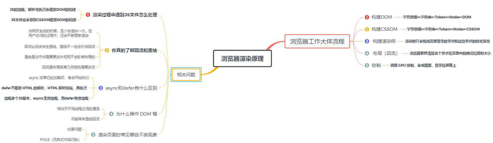
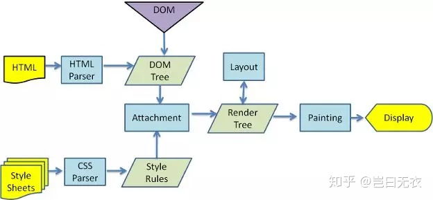
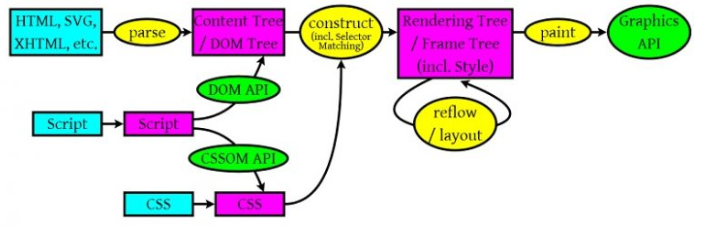

# 浏览器的渲染过程与原理

## 浏览器的渲染原理

浏览器的内核是指支持浏览器运行的最核心的程序，分为两个部分的，一是渲染引擎，另一个是JS引擎。渲染引擎在不同的浏览器中也不是都相同的。
浏览器会把HTML解析成DOM，把CSS解析成CSSOM，DOM和CSSOM合并就产生了Render Tree。有了RenderTree，我们就知道了所有节点的样式，
然后计算他们在页面上的大小和位置，最后把节点绘制到页面上。

浏览器的渲染原理图：

## 渲染过程

浏览器的渲染流程图：

包含JS对DOM操作的渲染流程：

浏览器工作流程大体分为如下三部分：

### 1. 浏览器会解析三个东西

* 一个是HTML/SVG/XHTML，事实上，Webkit有三个C++的类对应这三类文档。解析这三种文件会产生一个DOM Tree。
* CSS，解析CSS会产生CSS规则树。
* Javascript，脚本，主要是通过DOM API和CSSOM API来操作DOM Tree和CSS Rule Tree.

### 2.解析完成后，浏览器引擎会通过DOM Tree 和 CSS Rule Tree 来构造 Rendering Tree。

* Rendering Tree 渲染树并不等同于DOM树，因为一些像Header或display:none的东西就没必要放在渲染树中了。
* CSS 的 Rule Tree主要是为了完成匹配并把CSS Rule附加上Rendering Tree上的每个Element。也就是DOM节点。
* 然后，计算每个元素（也就是每个Element）的位置，这又叫layout和reflow过程。

### 最后通过调用操作系统Native GUI的API绘制。

* 通过操作系统的Native GUI完成绘制过程，整个页面就在浏览器中展示出来了。

提到浏览器渲染过程就就个东西必须要将，那就是回流与重绘。

## 回流与重绘

### 回流（reflow）

当Render Tree中部分或全部元素的尺寸、结构、或某些属性发生改变时，浏览器重新渲染部分或全部文档的过程称为回流。

会导致回流的操作：

* 页面首次渲染
* 浏览器窗口大小发生改变
* 元素尺寸或位置发生改变
* 元素内容变化（文字数量或图片大小等等）
* 元素字体大小变化
* 添加或者删除可见的DOM元素
* 激活CSS伪类（例如：:hover）
* 查询某些属性或调用某些方法

一些常用且会导致回流的属性和方法：

* clientWidth、clientHeight、clientTop、clientLeft
* offsetWidth、offsetHeight、offsetTop、offsetLeft
* scrollWidth、scrollHeight、scrollTop、scrollLeft
* scrollIntoView()、scrollIntoViewIfNeeded()
* getComputedStyle()
* getBoundingClientRect()
* scrollTo()

### 重绘（repaint）

当页面中元素样式的改变并不影响它在文档流中的位置时（例如：color、background-color、visibility等），浏览器会将新样式赋予给元素并重新绘制它，这个过程称为重绘。

### 性能影响

回流会造成浏览器需要重新布局（layout），这会产生大量的计算，是非常损耗性能的，重绘对性能的影响较小。

有时即使仅仅回流一个单一的元素，它的父元素以及任何跟随它的元素也会产生回流。

现代浏览器会对频繁的回流或重绘操作进行优化：

浏览器会维护一个队列，把所有引起回流和重绘的操作放入队列中，如果队列中的任务数量或者时间间隔达到一个阈值的，浏览器就会将队列清空，进行一次批处理，这样可以把多次回流和重绘变成一次。

当你访问以下属性或方法时，浏览器会立刻清空队列：

* clientWidth、clientHeight、clientTop、clientLeft
* offsetWidth、offsetHeight、offsetTop、offsetLeft
* scrollWidth、scrollHeight、scrollTop、scrollLeft
* width、height
* getComputedStyle()
* getBoundingClientRect()

因为队列中可能会有影响到这些属性或方法返回值的操作，即使你希望获取的信息与队列中操作引发的改变无关，浏览器也会强行清空队列，确保你拿到的值是最精确的。

### 如何避免

#### CSS

* 避免使用table布局。
* 尽可能在DOM树的最末端改变class。
* 避免设置多层内联样式。
* 将动画效果应用到position属性为absolute或fixed的元素上。
* 避免使用CSS表达式（例如：calc()）。

#### JS

* 避免频繁操作样式，最好一次性重写style属性，或者将样式列表定义为class并一次性更改class属性。
* 避免频繁操作DOM，创建一个documentFragment，在它上面应用所有DOM操作，最后再把它添加到文档中。
* 也可以先为元素设置display: none，操作结束后再把它显示出来。因为在display属性为none的元素上进行的DOM操作不会引发回流和重绘。
* 避免频繁读取会引发回流/重绘的属性，如果确实需要多次使用，就用一个变量缓存起来。
* 对具有复杂动画的元素使用绝对定位，使它脱离文档流，否则会引起父元素及后续元素频繁回流。
