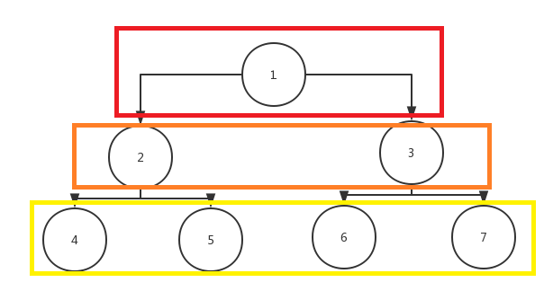

## 虚拟DOM和Diff算法

### 虚拟DOM

虚拟DOM不是真实的DOM，而是一个JS对象。它的作用是判断DOM是否改变、哪些部分需要被重新渲染。这样，不需要操纵真实的DOM,极大的提高了React的性能。

* React的DOM渲染步骤

```
1. state 数据
2. JSX语法 模板
3. 数据 + 模板 生成虚拟DOM(就是用js对象表示真实DOM)
4. 用虚拟DOM 结构生成真实DOM 渲染页面
5. state改变
6. 数据 + 模板 生成新的虚拟DOM
7. 旧的虚拟DOM和新的虚拟DOM做对比，找出发送改变的DOM
8. 操作真实的DOM,把改变的内容替换掉
```

* 优点

```
1. 性能提升了
2. 它使得跨端应用得以实现。React Native，因为不使用真实DOM,而是虚拟DOM,js对象可以在浏览器、node、或者原生应用中。
```

### Diff算法

* Diff算法就是在虚拟DOM树从上至下进行同层比对，如果上层已经不同了，那么下面的DOM全部重新渲染。这样的好处是算法简单，减少比对次数，加快算法完成速度。
* 示意图



* key值的作用

由于key值用于循环输出的DOM，比如ul下的li，那么这些li在同一层。在旧虚拟DOM和新虚拟DOM比对时，需要标识比对对象。比如上图，旧的4需要和新的4比对，
如果没有key就需要遍历查找比较对象，耗费性能。

由此可见，key关系到虚拟DOM的比对对象查找，所以key需要唯一且不可变，所以说index作为key值不合适，因为index可能会随li的个数的改变而改变
